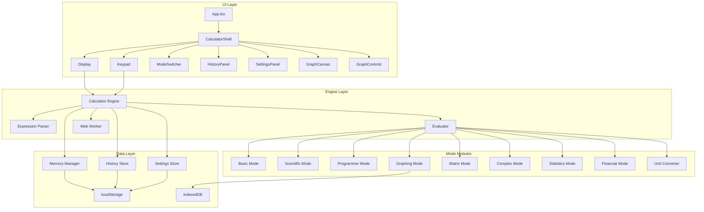

# Design Document: Advanced Calculator

## Overview

This document describes the technical design for a production-ready, web-based advanced calculator application. The application is built with React 18 + TypeScript, using Vite as the bundler, Tailwind CSS for styling, mathjs for expression parsing and symbolic operations, decimal.js for arbitrary precision arithmetic, and Plotly.js for graphing capabilities.

The architecture follows a modular design with clear separation between the UI layer, calculation engine, and data persistence. Heavy computations are offloaded to Web Workers to maintain UI responsiveness. The application uses code-splitting to lazy-load the Graphing and Programmer modules, keeping the initial bundle size under 250KB gzipped.

## Architecture



### Layer Responsibilities

**UI Layer**: React components responsible for rendering the calculator interface, handling user input, and displaying results. Components are organized by feature area (Calculator, Graph, Shared).

**Engine Layer**: Core computation logic including expression parsing, evaluation, and result formatting. The engine coordinates between the parser, evaluator, and Web Worker for heavy computations.

**Mode Modules**: Specialized calculation modules for each calculator mode. Each module implements the specific operations for its domain (trigonometry, bitwise ops, matrix math, etc.).

**Data Layer**: Persistence layer using localStorage for settings, history, and memory. IndexedDB is used for larger data like graph configurations and batch calculation results.

## Components and Interfaces

### Core Components

```typescript
// src/components/Calculator/CalculatorShell.tsx
interface CalculatorShellProps {
  initialMode?: CalculatorMode;
}

// Main container component that orchestrates all calculator functionality
// Manages mode switching, panel visibility, and keyboard shortcuts
```

```typescript
// src/components/Calculator/Display.tsx
interface DisplayProps {
  expression: string;
  result: CalculationResult | null;
  error: string | null;
  isLoading: boolean;
  precision: number;
  locale: string;
}

// Renders the current expression and result
// Handles number formatting based on precision and locale settings
// Announces results to screen readers via ARIA live regions
```

```typescript
// src/components/Calculator/Keypad.tsx
interface KeypadProps {
  mode: CalculatorMode;
  onInput: (input: KeypadInput) => void;
  onAction: (action: KeypadAction) => void;
  disabled: boolean;
}

// Renders mode-specific calculator buttons
// Adapts layout based on viewport size
// Ensures minimum 44px touch targets on mobile
```

```typescript
// src/components/Calculator/ModeSwitcher.tsx
interface ModeSwitcherProps {
  currentMode: CalculatorMode;
  onModeChange: (mode: CalculatorMode) => void;
}

// Tab-based mode selection component
// Supports keyboard navigation (Alt + 1-9)
```

```typescript
// src/components/Calculator/HistoryPanel.tsx
interface HistoryPanelProps {
  history: HistoryEntry[];
  onSelect: (entry: HistoryEntry) => void;
  onPin: (id: string) => void;
  onClear: () => void;
  isVisible: boolean;
}

// Displays calculation history with timestamps
// Supports pinning/favoriting entries
// Filterable and searchable
```

```typescript
// src/components/Calculator/SettingsPanel.tsx
interface SettingsPanelProps {
  settings: CalculatorSettings;
  onSettingsChange: (settings: Partial<CalculatorSettings>) => void;
  isVisible: boolean;
}

// Configuration panel for precision, angle mode, locale, etc.
// Includes keyboard shortcuts help section
// High-contrast toggle
```

### Graph Components

```typescript
// src/components/Graph/GraphCanvas.tsx
interface GraphCanvasProps {
  functions: GraphFunction[];
  xRange: [number, number];
  yRange: [number, number];
  onRangeChange: (xRange: [number, number], yRange: [number, number]) => void;
  onExport: (format: 'png' | 'svg') => void;
}

// Plotly.js wrapper for function plotting
// Supports pan, zoom, hover tooltips
// Handles multiple series with color coding
```

```typescript
// src/components/Graph/GraphControls.tsx
interface GraphControlsProps {
  functions: GraphFunction[];
  onAddFunction: (expr: string) => void;
  onRemoveFunction: (id: string) => void;
  onToggleFunction: (id: string) => void;
  xRange: [number, number];
  yRange: [number, number];
  onRangeChange: (xRange: [number, number], yRange: [number, number]) => void;
}

// Controls for managing graph functions and range
// Expression input with validation
// Series visibility toggles
```

### Shared Components

```typescript
// src/components/Shared/IconButton.tsx
interface IconButtonProps {
  icon: React.ReactNode;
  label: string;
  onClick: () => void;
  disabled?: boolean;
  variant?: 'primary' | 'secondary' | 'ghost';
}

// Accessible button with icon and ARIA label
```

```typescript
// src/components/Shared/Toggle.tsx
interface ToggleProps {
  checked: boolean;
  onChange: (checked: boolean) => void;
  label: string;
  disabled?: boolean;
}

// Accessible toggle switch component
```

```typescript
// src/components/Shared/Modal.tsx
interface ModalProps {
  isOpen: boolean;
  onClose: () => void;
  title: string;
  children: React.ReactNode;
}

// Accessible modal dialog with focus trap
```

### Engine Interfaces

```typescript
// src/engine/index.ts
interface CalculatorEngine {
  evaluate(expression: string): Promise<CalculationResult>;
  parse(expression: string): ASTNode;
  prettyPrint(ast: ASTNode): string;
  setMode(mode: CalculatorMode): void;
  setVariable(name: string, value: number | Complex): void;
  defineFunction(name: string, params: string[], body: string): void;
  getVariables(): Map<string, number | Complex>;
  getFunctions(): Map<string, CustomFunction>;
  undo(): void;
  redo(): void;
  canUndo(): boolean;
  canRedo(): boolean;
}
```

```typescript
// src/engine/parser.ts
interface ExpressionParser {
  parse(expression: string): ASTNode;
  tokenize(expression: string): Token[];
  validate(expression: string): ValidationResult;
}

interface ASTNode {
  type: 'number' | 'operator' | 'function' | 'variable' | 'constant';
  value: string | number;
  children?: ASTNode[];
  position: { start: number; end: number };
}

interface Token {
  type: TokenType;
  value: string;
  position: number;
}

type TokenType = 
  | 'number' 
  | 'operator' 
  | 'function' 
  | 'variable' 
  | 'constant' 
  | 'lparen' 
  | 'rparen' 
  | 'comma';
```

```typescript
// src/engine/worker.ts
// Web Worker message types
interface WorkerRequest {
  id: string;
  type: 'evaluate' | 'graph' | 'matrix' | 'batch';
  payload: unknown;
}

interface WorkerResponse {
  id: string;
  type: 'result' | 'error' | 'progress';
  payload: unknown;
}
```

### Mode-Specific Interfaces

```typescript
// Programmer Mode
interface ProgrammerEngine {
  toBase(value: bigint, base: 2 | 8 | 10 | 16): string;
  fromBase(value: string, base: 2 | 8 | 10 | 16): bigint;
  bitwiseAnd(a: bigint, b: bigint): bigint;
  bitwiseOr(a: bigint, b: bigint): bigint;
  bitwiseXor(a: bigint, b: bigint): bigint;
  bitwiseNot(a: bigint, bits: number): bigint;
  leftShift(a: bigint, n: number): bigint;
  rightShift(a: bigint, n: number): bigint;
  toTwosComplement(value: bigint, bits: number): bigint;
  fromTwosComplement(value: bigint, bits: number): bigint;
}
```

```typescript
// Matrix Mode
interface MatrixEngine {
  create(rows: number, cols: number, data?: number[][]): Matrix;
  multiply(a: Matrix, b: Matrix): Matrix;
  inverse(m: Matrix): Matrix;
  determinant(m: Matrix): number;
  transpose(m: Matrix): Matrix;
  solve(coefficients: Matrix, constants: number[]): number[];
  eigenvalues(m: Matrix): Complex[];
}

interface Matrix {
  rows: number;
  cols: number;
  data: number[][];
}
```

```typescript
// Complex Numbers
interface ComplexEngine {
  create(real: number, imag: number): Complex;
  fromPolar(magnitude: number, phase: number): Complex;
  add(a: Complex, b: Complex): Complex;
  multiply(a: Complex, b: Complex): Complex;
  divide(a: Complex, b: Complex): Complex;
  conjugate(c: Complex): Complex;
  magnitude(c: Complex): number;
  phase(c: Complex): number;
  toPolar(c: Complex): { magnitude: number; phase: number };
}

interface Complex {
  real: number;
  imag: number;
}
```

```typescript
// Statistics Mode
interface StatisticsEngine {
  mean(data: number[]): number;
  median(data: number[]): number;
  mode(data: number[]): number[];
  variance(data: number[], population?: boolean): number;
  standardDeviation(data: number[], population?: boolean): number;
  normalPdf(x: number, mean: number, stdDev: number): number;
  normalCdf(x: number, mean: number, stdDev: number): number;
  binomialPmf(k: number, n: number, p: number): number;
  poissonPmf(k: number, lambda: number): number;
}
```

```typescript
// Financial Mode
interface FinancialEngine {
  futureValue(pv: number, rate: number, periods: number, pmt?: number): number;
  presentValue(fv: number, rate: number, periods: number, pmt?: number): number;
  payment(pv: number, rate: number, periods: number, fv?: number): number;
  periods(pv: number, fv: number, rate: number, pmt?: number): number;
  rate(pv: number, fv: number, periods: number, pmt?: number): number;
  amortizationSchedule(principal: number, rate: number, periods: number): AmortizationEntry[];
}

interface AmortizationEntry {
  period: number;
  payment: number;
  principal: number;
  interest: number;
  balance: number;
}
```

```typescript
// Unit Converter
interface UnitConverter {
  convert(value: number, fromUnit: string, toUnit: string): number;
  getCategories(): string[];
  getUnits(category: string): UnitInfo[];
  setExchangeRates(rates: Record<string, number>): void;
}

interface UnitInfo {
  id: string;
  name: string;
  symbol: string;
  category: string;
}
```

### Hook Interfaces

```typescript
// src/hooks/useKeyboardShortcuts.ts
interface KeyboardShortcut {
  key: string;
  modifiers?: ('ctrl' | 'alt' | 'shift' | 'meta')[];
  action: () => void;
  description: string;
}

function useKeyboardShortcuts(shortcuts: KeyboardShortcut[]): void;
```

```typescript
// src/hooks/useLocalStorage.ts
function useLocalStorage<T>(key: string, initialValue: T): [T, (value: T) => void];
```

## Data Models

### Core Types

```typescript
// Calculator modes
type CalculatorMode = 
  | 'basic'
  | 'scientific'
  | 'programmer'
  | 'graphing'
  | 'matrix'
  | 'complex'
  | 'statistics'
  | 'financial'
  | 'converter';

// Calculation result
interface CalculationResult {
  value: number | bigint | Complex | Matrix | string;
  type: 'number' | 'bigint' | 'complex' | 'matrix' | 'string';
  formatted: string;
  precision: number;
}

// History entry
interface HistoryEntry {
  id: string;
  expression: string;
  result: CalculationResult;
  mode: CalculatorMode;
  timestamp: number;
  pinned: boolean;
}

// Graph function
interface GraphFunction {
  id: string;
  expression: string;
  color: string;
  visible: boolean;
  type: 'cartesian' | 'parametric';
  parametricVar?: string;
}

// Settings
interface CalculatorSettings {
  precision: number;
  angleMode: 'degrees' | 'radians';
  decimalSeparator: '.' | ',';
  thousandsSeparator: ',' | '.' | ' ' | '';
  highContrast: boolean;
  onboardingComplete: boolean;
  currencyApiEnabled: boolean;
}

// Memory
interface MemoryState {
  register: number;
  namedSlots: Record<string, number>;
}

// Custom function
interface CustomFunction {
  name: string;
  params: string[];
  body: string;
}

// Validation result
interface ValidationResult {
  valid: boolean;
  errors: ValidationError[];
}

interface ValidationError {
  message: string;
  position: { start: number; end: number };
}
```

### Keypad Types

```typescript
type KeypadInput = 
  | { type: 'digit'; value: string }
  | { type: 'operator'; value: string }
  | { type: 'function'; value: string }
  | { type: 'constant'; value: string }
  | { type: 'parenthesis'; value: '(' | ')' };

type KeypadAction = 
  | { type: 'evaluate' }
  | { type: 'clear' }
  | { type: 'clearEntry' }
  | { type: 'backspace' }
  | { type: 'memoryAdd' }
  | { type: 'memorySubtract' }
  | { type: 'memoryRecall' }
  | { type: 'memoryClear' }
  | { type: 'undo' }
  | { type: 'redo' };
```

### Storage Schema

```typescript
// localStorage keys
const STORAGE_KEYS = {
  SETTINGS: 'calc_settings',
  HISTORY: 'calc_history',
  MEMORY: 'calc_memory',
  VARIABLES: 'calc_variables',
  FUNCTIONS: 'calc_functions',
  ONBOARDING: 'calc_onboarding',
} as const;

// IndexedDB schema
interface CalcDatabase {
  graphConfigs: {
    key: string;
    value: {
      id: string;
      name: string;
      functions: GraphFunction[];
      xRange: [number, number];
      yRange: [number, number];
      createdAt: number;
    };
  };
  batchResults: {
    key: string;
    value: {
      id: string;
      input: string[];
      results: (CalculationResult | { error: string })[];
      createdAt: number;
    };
  };
}
```

### AST Node Types

```typescript
// Detailed AST node types for expression parsing
type ASTNodeType = 
  | NumberNode
  | BinaryOpNode
  | UnaryOpNode
  | FunctionCallNode
  | VariableNode
  | ConstantNode
  | MatrixNode
  | ComplexNode;

interface NumberNode {
  type: 'number';
  value: number;
  raw: string;
  position: Position;
}

interface BinaryOpNode {
  type: 'binaryOp';
  operator: '+' | '-' | '*' | '/' | '^' | '%';
  left: ASTNodeType;
  right: ASTNodeType;
  position: Position;
}

interface UnaryOpNode {
  type: 'unaryOp';
  operator: '-' | '+' | '!';
  operand: ASTNodeType;
  position: Position;
}

interface FunctionCallNode {
  type: 'functionCall';
  name: string;
  args: ASTNodeType[];
  position: Position;
}

interface VariableNode {
  type: 'variable';
  name: string;
  position: Position;
}

interface ConstantNode {
  type: 'constant';
  name: 'pi' | 'e' | 'phi' | 'tau';
  value: number;
  position: Position;
}

interface MatrixNode {
  type: 'matrix';
  rows: ASTNodeType[][];
  position: Position;
}

interface ComplexNode {
  type: 'complex';
  real: ASTNodeType;
  imag: ASTNodeType;
  position: Position;
}

interface Position {
  start: number;
  end: number;
}
```


## Correctness Properties

*A property is a characteristic or behavior that should hold true across all valid executions of a system—essentially, a formal statement about what the system should do. Properties serve as the bridge between human-readable specifications and machine-verifiable correctness guarantees.*

### Property 1: Expression Parsing Round-Trip

*For any* valid mathematical expression, parsing the expression into an AST, then pretty-printing the AST back to a string, then parsing that string again SHALL produce an equivalent AST.

**Validates: Requirements 10.7**

### Property 2: Basic Arithmetic Evaluation

*For any* valid arithmetic expression containing addition, subtraction, multiplication, division, parentheses, and percent operators, the Calculator_Engine SHALL evaluate to the mathematically correct result respecting operator precedence.

**Validates: Requirements 1.1, 1.2, 1.3**

### Property 3: Scientific Function Accuracy

*For any* valid input to scientific functions (sin, cos, tan, sinh, cosh, exp, ln, log10, factorial, power, nth-root, gamma), the Calculator_Engine SHALL compute results that match the mathematical definition within the configured precision tolerance.

**Validates: Requirements 2.2, 2.3, 2.4, 2.5, 2.6**

### Property 4: Angle Mode Consistency

*For any* trigonometric function call, WHEN angle mode is set to degrees, the result SHALL equal the result of the same function called with the input converted to radians. Specifically: sin_degrees(x) = sin_radians(x * π/180).

**Validates: Requirements 2.7, 2.8**

### Property 5: Number Base Conversion Round-Trip

*For any* integer value and any base (2, 8, 10, 16), converting the value to that base and back to decimal SHALL produce the original value. Formally: fromBase(toBase(n, base), base) = n.

**Validates: Requirements 3.1, 3.2**

### Property 6: Bitwise Operation Correctness

*For any* pair of integers and any bitwise operation (AND, OR, XOR, NOT, left shift, right shift), the Calculator_Engine SHALL compute results consistent with standard bitwise semantics. Specifically: leftShift(x, n) = x * 2^n for non-negative n.

**Validates: Requirements 3.3, 3.4**

### Property 7: Two's Complement Consistency

*For any* negative integer within the supported bit width, converting to two's complement and back SHALL produce the original value.

**Validates: Requirements 3.5**

### Property 8: Graph Series Color Uniqueness

*For any* set of graph functions added to the Graph_Canvas, each function SHALL be assigned a distinct color that differs from all other functions in the set.

**Validates: Requirements 4.2**

### Property 9: Matrix Creation Preservation

*For any* matrix data (rows, columns, values), creating a Matrix object SHALL preserve all input values at their correct positions.

**Validates: Requirements 5.1**

### Property 10: Matrix Multiplication Associativity

*For any* three compatible matrices A, B, C, the Matrix_Engine SHALL satisfy (A × B) × C = A × (B × C) within floating-point tolerance.

**Validates: Requirements 5.2**

### Property 11: Matrix Inverse Identity

*For any* invertible square matrix A, the Matrix_Engine SHALL satisfy A × A⁻¹ = I (identity matrix) within floating-point tolerance.

**Validates: Requirements 5.3**

### Property 12: Determinant Multiplicativity

*For any* two square matrices A and B of the same dimension, the Matrix_Engine SHALL satisfy det(A × B) = det(A) × det(B) within floating-point tolerance.

**Validates: Requirements 5.5**

### Property 13: Linear System Solution Verification

*For any* solvable system of linear equations Ax = b, the solution x returned by the Matrix_Engine SHALL satisfy Ax = b when substituted back.

**Validates: Requirements 5.6**

### Property 14: Complex Number Parsing Preservation

*For any* complex number in rectangular form (a + bi), parsing SHALL preserve both the real part (a) and imaginary part (b) exactly.

**Validates: Requirements 6.1**

### Property 15: Complex Arithmetic Correctness

*For any* two complex numbers z1 = (a + bi) and z2 = (c + di), addition SHALL produce (a+c) + (b+d)i, and multiplication SHALL produce (ac-bd) + (ad+bc)i.

**Validates: Requirements 6.2**

### Property 16: Complex Representation Round-Trip

*For any* complex number, converting from rectangular to polar form and back to rectangular SHALL produce an equivalent complex number within floating-point tolerance.

**Validates: Requirements 6.3, 6.4**

### Property 17: Statistical Mean Definition

*For any* non-empty data set, the mean computed by Statistics_Engine SHALL equal the sum of all values divided by the count of values.

**Validates: Requirements 7.1**

### Property 18: Standard Deviation Consistency

*For any* non-empty data set, the standard deviation computed by Statistics_Engine SHALL equal the square root of the variance.

**Validates: Requirements 7.2**

### Property 19: Probability Distribution Properties

*For any* probability distribution function, the CDF SHALL be monotonically non-decreasing, with CDF(-∞) = 0 and CDF(+∞) = 1.

**Validates: Requirements 7.3**

### Property 20: TVM Calculation Consistency

*For any* valid set of four TVM variables (N, I/Y, PV, FV, PMT), computing the fifth variable and then using all five to recompute any of the original four SHALL produce the same value within tolerance.

**Validates: Requirements 8.1, 8.2**

### Property 21: Amortization Schedule Balance

*For any* loan with principal P, the sum of all principal payments in the amortization schedule SHALL equal P, and the final balance SHALL be zero.

**Validates: Requirements 8.3**

### Property 22: Unit Conversion Round-Trip

*For any* value and any pair of compatible units, converting from unit A to unit B and back to unit A SHALL produce the original value within floating-point tolerance.

**Validates: Requirements 9.2**

### Property 23: Temperature Conversion Accuracy

*For any* temperature value, converting through the chain Celsius → Fahrenheit → Kelvin → Celsius SHALL produce the original value within floating-point tolerance.

**Validates: Requirements 9.4**

### Property 24: Implicit Multiplication Equivalence

*For any* expression with implicit multiplication (e.g., "2x", "3(4)", "xy"), the parsed result SHALL be equivalent to the same expression with explicit multiplication operators.

**Validates: Requirements 10.2**

### Property 25: Mathematical Constants Accuracy

*For any* use of mathematical constants (π, e, φ, τ), the substituted values SHALL be accurate to at least 15 significant digits.

**Validates: Requirements 10.3**

### Property 26: Variable Assignment Persistence

*For any* variable assignment (name = value), subsequent expressions using that variable name SHALL evaluate using the assigned value until reassigned.

**Validates: Requirements 10.4**

### Property 27: Custom Function Evaluation

*For any* custom function definition f(params) = body, calling f with arguments SHALL evaluate the body with parameters substituted by the corresponding arguments.

**Validates: Requirements 10.5**

### Property 28: Arbitrary Precision Accuracy

*For any* calculation in arbitrary precision mode with precision P, the result SHALL be accurate to at least P significant digits.

**Validates: Requirements 11.1, 11.2**

### Property 29: Display Precision Formatting

*For any* calculation result and precision setting P, the formatted display SHALL show exactly P significant digits (or fewer if the result is exact).

**Validates: Requirements 11.3**

### Property 30: Batch Calculation Completeness

*For any* CSV import with N valid expressions, the batch calculation SHALL produce exactly N results, one for each expression.

**Validates: Requirements 12.1**

### Property 31: History Entry Creation

*For any* completed calculation, a history entry SHALL be created containing the expression, result, mode, and a timestamp within 1 second of completion.

**Validates: Requirements 13.1**

### Property 32: History Clear Preserves Pinned

*For any* history clear operation, all pinned entries SHALL remain in the history while all non-pinned entries are removed.

**Validates: Requirements 13.4**

### Property 33: History Persistence

*For any* history state, the data persisted to localStorage SHALL allow complete reconstruction of the history after page reload.

**Validates: Requirements 13.5**

### Property 34: Memory Operations Consistency

*For any* sequence of memory operations (M+, M-, MR, MC), the memory register SHALL maintain the correct cumulative value. Specifically: after M+(x) then M-(y), MR SHALL return the previous value + x - y.

**Validates: Requirements 14.1, 14.2, 14.3, 14.4**

### Property 35: Named Memory Slot Storage

*For any* named memory slot assignment (name, value), recalling that slot SHALL return the exact value that was stored.

**Validates: Requirements 14.5**

### Property 36: Memory Persistence

*For any* memory state (register and named slots), the data persisted to localStorage SHALL allow complete reconstruction after page reload.

**Validates: Requirements 14.6**

### Property 37: Undo-Redo Round-Trip

*For any* input change followed by undo then redo, the final state SHALL equal the state after the original change.

**Validates: Requirements 15.1, 15.2**

### Property 38: Mobile Touch Target Size

*For any* interactive element in the Keypad_Component on viewports < 768px, the touch target SHALL have minimum dimensions of 44px × 44px.

**Validates: Requirements 16.4**

### Property 39: Keyboard Input Append

*For any* numeric or operator key press, the corresponding character SHALL be appended to the current expression.

**Validates: Requirements 17.8**

### Property 40: ARIA Labels Completeness

*For any* interactive element in the Keypad_Component, there SHALL exist an appropriate ARIA role and accessible label.

**Validates: Requirements 18.2**

### Property 41: WCAG AA Contrast Compliance

*For any* text element in the Display_Component, the contrast ratio between text color and background color SHALL be at least 4.5:1 for normal text and 3:1 for large text.

**Validates: Requirements 18.3**

### Property 42: Focus Navigation Order

*For any* sequence of Tab key presses starting from the first focusable element, focus SHALL move through all interactive elements in a logical order without skipping any.

**Validates: Requirements 18.6**

### Property 43: Settings Application Immediacy

*For any* settings change (precision, angle mode, locale), the change SHALL take effect immediately without requiring page reload or explicit save action.

**Validates: Requirements 19.2, 19.3, 19.4**

### Property 44: Settings Persistence

*For any* settings state, the data persisted to localStorage SHALL allow complete reconstruction of settings after page reload.

**Validates: Requirements 19.7**

### Property 45: Onboarding State Persistence

*For any* onboarding completion, the completion status persisted to localStorage SHALL prevent onboarding from showing on subsequent visits.

**Validates: Requirements 20.3**

### Property 46: Local Data Storage Exclusivity

*For any* user data (settings, history, memory, variables, functions), the data SHALL be stored exclusively in localStorage or IndexedDB, with no data sent to external servers.

**Validates: Requirements 22.3**

### Property 47: Data Import Restoration

*For any* exported data file, importing that file SHALL restore all settings, history, and memory to the state at export time.

**Validates: Requirements 22.5**

## Error Handling

### Expression Parsing Errors

| Error Condition | Error Code | User Message | Recovery Action |
|----------------|------------|--------------|-----------------|
| Unbalanced parentheses | PARSE_UNBALANCED_PARENS | "Mismatched parentheses" | Highlight unmatched paren |
| Invalid operator sequence | PARSE_INVALID_OPERATOR | "Unexpected operator" | Highlight invalid position |
| Unknown function | PARSE_UNKNOWN_FUNCTION | "Unknown function: {name}" | Suggest similar functions |
| Invalid number format | PARSE_INVALID_NUMBER | "Invalid number format" | Highlight invalid portion |
| Missing operand | PARSE_MISSING_OPERAND | "Missing operand" | Highlight gap |

### Calculation Errors

| Error Condition | Error Code | User Message | Recovery Action |
|----------------|------------|--------------|-----------------|
| Division by zero | CALC_DIV_ZERO | "Cannot divide by zero" | Show infinity symbol option |
| Overflow | CALC_OVERFLOW | "Result too large" | Suggest precision mode |
| Underflow | CALC_UNDERFLOW | "Result too small" | Show as 0 or scientific notation |
| Domain error (e.g., sqrt(-1)) | CALC_DOMAIN | "Invalid input for function" | Suggest complex mode |
| Factorial of negative | CALC_FACTORIAL_NEG | "Factorial requires non-negative integer" | Show gamma function option |

### Matrix Errors

| Error Condition | Error Code | User Message | Recovery Action |
|----------------|------------|--------------|-----------------|
| Singular matrix | MATRIX_SINGULAR | "Matrix is singular (no inverse)" | Show determinant = 0 |
| Dimension mismatch | MATRIX_DIM_MISMATCH | "Matrix dimensions incompatible" | Show required dimensions |
| Non-square matrix | MATRIX_NOT_SQUARE | "Operation requires square matrix" | Show matrix dimensions |

### Financial Errors

| Error Condition | Error Code | User Message | Recovery Action |
|----------------|------------|--------------|-----------------|
| Negative periods | FIN_NEG_PERIODS | "Periods must be positive" | Clear and refocus field |
| Invalid rate | FIN_INVALID_RATE | "Interest rate must be valid" | Show valid range |
| No solution | FIN_NO_SOLUTION | "No solution exists for given parameters" | Suggest parameter adjustment |

### Storage Errors

| Error Condition | Error Code | User Message | Recovery Action |
|----------------|------------|--------------|-----------------|
| Storage quota exceeded | STORAGE_QUOTA | "Storage full" | Offer to clear old history |
| Import parse error | IMPORT_PARSE | "Invalid import file format" | Show expected format |
| Corrupted data | STORAGE_CORRUPT | "Data corrupted, using defaults" | Reset to defaults |

### Error Display Strategy

1. **Inline errors**: Show parsing errors directly in the expression editor with red underline and tooltip
2. **Toast notifications**: Show calculation errors as dismissible toast messages
3. **Modal dialogs**: Show critical errors (storage full, data corruption) as modal dialogs requiring user action
4. **ARIA announcements**: All errors announced to screen readers via aria-live regions

## Testing Strategy

### Overview

The testing strategy employs a dual approach combining unit tests for specific examples and edge cases with property-based tests for universal correctness properties. This combination ensures both concrete bug detection and general correctness verification.

### Unit Testing

**Framework**: Jest + React Testing Library

**Coverage Target**: ≥80% code coverage for the engine module

**Focus Areas**:
- Specific examples demonstrating correct behavior
- Edge cases (division by zero, empty inputs, boundary values)
- Error conditions and error message accuracy
- Integration points between components
- UI component rendering and interaction

**Unit Test Categories**:

1. **Expression Parser Tests**
   - Valid expression parsing examples
   - Invalid expression error detection
   - Operator precedence verification
   - Implicit multiplication cases

2. **Calculator Engine Tests**
   - Basic arithmetic examples
   - Scientific function edge cases
   - Mode switching behavior
   - Variable and function storage

3. **Matrix Engine Tests**
   - Small matrix operation examples
   - Singular matrix detection
   - Dimension validation

4. **UI Component Tests**
   - Component rendering
   - User interaction handling
   - Accessibility attribute presence
   - Responsive layout behavior

### Property-Based Testing

**Framework**: fast-check (TypeScript property-based testing library)

**Configuration**: Minimum 100 iterations per property test

**Tag Format**: Each test tagged with `Feature: advanced-calculator, Property {number}: {property_text}`

**Property Test Implementation**:

Each correctness property from the design document SHALL be implemented as a single property-based test. The test SHALL:
1. Generate random valid inputs using fast-check arbitraries
2. Execute the operation under test
3. Verify the property holds for all generated inputs
4. Report counterexamples on failure

**Generator Strategy**:

```typescript
// Example generators for property tests
const expressionArb = fc.oneof(
  fc.integer().map(n => n.toString()),
  fc.tuple(fc.integer(), fc.constantFrom('+', '-', '*', '/'), fc.integer())
    .map(([a, op, b]) => `${a} ${op} ${b}`),
  // ... more complex expression generators
);

const matrixArb = (rows: number, cols: number) =>
  fc.array(fc.array(fc.float(), { minLength: cols, maxLength: cols }), 
           { minLength: rows, maxLength: rows });

const complexArb = fc.tuple(fc.float(), fc.float())
  .map(([real, imag]) => ({ real, imag }));
```

### End-to-End Testing

**Framework**: Playwright

**Test Scenarios**:

1. **Basic Calculation Flow**
   - Enter expression → Evaluate → Verify result
   - Test all basic operations

2. **Mode Switching Flow**
   - Switch between all modes
   - Verify mode-specific UI elements appear

3. **History Flow**
   - Perform calculations → View history → Recall entry
   - Pin/unpin entries → Clear history

4. **Settings Flow**
   - Change precision → Verify result formatting
   - Change angle mode → Verify trig results
   - Enable high contrast → Verify styles

5. **Graph Flow**
   - Enter function → Verify plot renders
   - Add multiple functions → Verify colors
   - Pan/zoom → Verify interaction
   - Export → Verify file download

6. **Keyboard Navigation Flow**
   - Tab through all elements
   - Use all keyboard shortcuts
   - Verify focus management

### Accessibility Testing

**Framework**: axe-core integrated with Jest and Playwright

**Test Coverage**:
- All pages scanned for WCAG AA violations
- Color contrast verification
- ARIA attribute validation
- Keyboard navigation completeness
- Screen reader announcement verification

### Performance Testing

**Bundle Size Validation**:
- Automated check that initial bundle < 250KB gzipped
- Verify lazy-loaded modules not in initial bundle

**Lighthouse CI**:
- Automated Lighthouse runs in CI
- Fail build if performance score < 90

**Web Worker Verification**:
- Test that heavy computations execute in worker
- Verify UI remains responsive during computation

### Test Organization

```
src/tests/
├── unit/
│   ├── engine/
│   │   ├── parser.test.ts
│   │   ├── evaluator.test.ts
│   │   ├── matrix.test.ts
│   │   ├── complex.test.ts
│   │   ├── statistics.test.ts
│   │   ├── financial.test.ts
│   │   └── programmer.test.ts
│   ├── components/
│   │   ├── Display.test.tsx
│   │   ├── Keypad.test.tsx
│   │   ├── HistoryPanel.test.tsx
│   │   └── SettingsPanel.test.tsx
│   └── hooks/
│       ├── useKeyboardShortcuts.test.ts
│       └── useLocalStorage.test.ts
├── property/
│   ├── parser.property.test.ts
│   ├── arithmetic.property.test.ts
│   ├── matrix.property.test.ts
│   ├── complex.property.test.ts
│   ├── conversion.property.test.ts
│   └── persistence.property.test.ts
├── e2e/
│   ├── basic-calculation.spec.ts
│   ├── mode-switching.spec.ts
│   ├── history.spec.ts
│   ├── settings.spec.ts
│   ├── graphing.spec.ts
│   └── accessibility.spec.ts
└── performance/
    ├── bundle-size.test.ts
    └── lighthouse.test.ts
```

### CI Integration

All tests run in GitHub Actions on every push:
1. Unit tests (Jest)
2. Property tests (fast-check via Jest)
3. E2E tests (Playwright)
4. Accessibility tests (axe-core)
5. Bundle size check
6. Lighthouse performance audit
