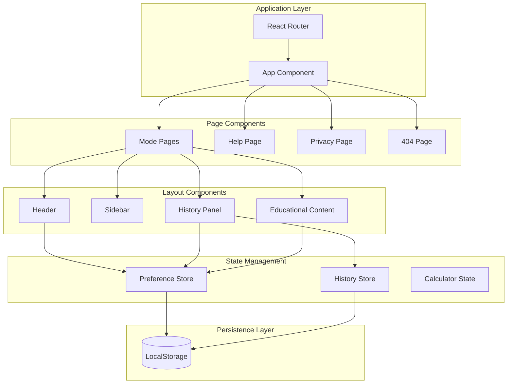
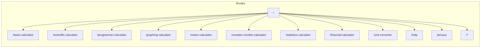

# Design Document: CalcPro Product Upgrade

## Overview

This design document outlines the technical architecture and implementation approach for upgrading CalcPro to a product-grade advanced web calculator. The upgrade introduces React Router for page-based navigation, a comprehensive preference persistence system, enhanced history panel functionality, dedicated help documentation, and SEO-optimized mode pages.

The design prioritizes:
- User control over UI visibility with persistent preferences
- SEO-friendly routing with dedicated pages per calculator mode
- Comprehensive help system accessible without interrupting workflow
- Clean separation between routing, state management, and UI components

## Architecture

### High-Level Architecture



### Routing Architecture



## Components and Interfaces

### Router Configuration

```typescript
// src/router/routes.ts
interface RouteConfig {
  path: string;
  mode?: CalculatorMode;
  title: string;
  description: string;
  component: React.ComponentType;
}

const routes: RouteConfig[] = [
  {
    path: '/',
    mode: 'basic',
    title: 'CalcPro - Free Online Calculator',
    description: 'Free online calculator with basic, scientific, programmer, and graphing modes.',
    component: CalculatorPage
  },
  {
    path: '/basic-calculator',
    mode: 'basic',
    title: 'Basic Calculator - CalcPro',
    description: 'Free basic calculator for everyday arithmetic calculations.',
    component: CalculatorPage
  },
  // ... additional routes
  {
    path: '/help',
    title: 'Help & Documentation - CalcPro',
    description: 'Learn how to use CalcPro calculator features.',
    component: HelpPage
  },
  {
    path: '/privacy',
    title: 'Privacy Policy - CalcPro',
    description: 'CalcPro privacy policy and data handling.',
    component: PrivacyPage
  }
];
```

### Preference Store Interface

```typescript
// src/engine/preferenceStore.ts
interface UIPreferences {
  guidanceVisible: boolean;
  educationalContentVisible: boolean;
  historyPanelOpen: boolean;
  sidebarOpen: boolean;
  helpTipsVisible: boolean;
  currentMode: CalculatorMode;
  viewMode: 'normal' | 'maximized' | 'compact';
}

interface PreferenceStore {
  // Getters
  getPreference<K extends keyof UIPreferences>(key: K): UIPreferences[K];
  getAllPreferences(): UIPreferences;
  
  // Setters
  setPreference<K extends keyof UIPreferences>(key: K, value: UIPreferences[K]): void;
  
  // Persistence
  persist(): void;
  restore(): void;
  
  // Subscription
  subscribe(callback: (prefs: UIPreferences) => void): () => void;
}
```

### Enhanced History Panel Interface

```typescript
// src/components/Layout/HistoryPanel.tsx
interface HistoryPanelProps {
  isOpen: boolean;
  entries: HistoryEntry[];
  guidanceVisible: boolean;
  onGuidanceToggle: () => void;
  onClear: () => void;
  onPin: (id: string) => void;
  onClose: () => void;
  onRerun?: (expression: string, mode: CalculatorMode) => void;
  onDelete?: (id: string) => void;
}

interface CollapsedPinnedViewProps {
  pinnedEntries: HistoryEntry[];
  onRerun: (expression: string, mode: CalculatorMode) => void;
  onExpand: () => void;
}
```

### Help Page Interface

```typescript
// src/pages/HelpPage.tsx
interface HelpSection {
  id: string;
  title: string;
  content: React.ReactNode;
  keywords: string[];
  relatedSections: string[];
  relatedModes?: CalculatorMode[];
}

interface HelpPageProps {
  initialSection?: string;
}
```

### Mode Page Interface

```typescript
// src/pages/CalculatorPage.tsx
interface CalculatorPageProps {
  mode: CalculatorMode;
}

interface ModePageMeta {
  title: string;
  description: string;
  keywords: string[];
  structuredData: object;
}
```

### Header Navigation Interface

```typescript
// src/components/Layout/Header.tsx
interface HeaderProps {
  mode: CalculatorMode;
  onSidebarToggle: () => void;
  onHistoryToggle: () => void;
  historyOpen: boolean;
  sidebarOpen: boolean;
  viewMode: 'normal' | 'maximized' | 'compact';
  onViewModeChange: (mode: 'normal' | 'maximized' | 'compact') => void;
  isFullscreen: boolean;
  onFullscreenToggle: () => void;
}

interface NavigationLink {
  path: string;
  label: string;
  icon?: React.ReactNode;
}
```

## Data Models

### UI Preferences Model

```typescript
interface UIPreferences {
  // Panel visibility
  guidanceVisible: boolean;
  educationalContentVisible: boolean;
  historyPanelOpen: boolean;
  sidebarOpen: boolean;
  helpTipsVisible: boolean;
  
  // Calculator state
  currentMode: CalculatorMode;
  viewMode: 'normal' | 'maximized' | 'compact';
  
  // Timestamps for debugging
  lastUpdated: number;
}

const DEFAULT_PREFERENCES: UIPreferences = {
  guidanceVisible: true,
  educationalContentVisible: true,
  historyPanelOpen: true,
  sidebarOpen: true,
  helpTipsVisible: true,
  currentMode: 'basic',
  viewMode: 'normal',
  lastUpdated: Date.now()
};
```

### Route Configuration Model

```typescript
interface RouteDefinition {
  path: string;
  mode?: CalculatorMode;
  meta: {
    title: string;
    description: string;
    keywords: string[];
    canonical?: string;
  };
  structuredData?: {
    '@type': string;
    name: string;
    description: string;
    applicationCategory: string;
  };
}

const MODE_ROUTES: Record<CalculatorMode, RouteDefinition> = {
  basic: {
    path: '/basic-calculator',
    mode: 'basic',
    meta: {
      title: 'Basic Calculator - Free Online Calculator | CalcPro',
      description: 'Free basic calculator for everyday arithmetic. Add, subtract, multiply, divide with proper order of operations.',
      keywords: ['basic calculator', 'online calculator', 'free calculator', 'arithmetic']
    },
    structuredData: {
      '@type': 'WebApplication',
      name: 'Basic Calculator',
      description: 'Free online basic calculator',
      applicationCategory: 'UtilitiesApplication'
    }
  },
  // ... other modes
};
```

### Help Content Model

```typescript
interface HelpTopic {
  id: string;
  title: string;
  slug: string;
  category: HelpCategory;
  content: string;
  examples?: HelpExample[];
  relatedTopics: string[];
  relatedModes?: CalculatorMode[];
  keywords: string[];
}

type HelpCategory = 
  | 'getting-started'
  | 'keypad-usage'
  | 'keyboard-shortcuts'
  | 'calculator-modes'
  | 'common-errors'
  | 'history-pinning'
  | 'layout-modes'
  | 'privacy'
  | 'faqs';

interface HelpExample {
  input: string;
  output: string;
  explanation: string;
}
```

### History Entry Model (Extended)

```typescript
interface HistoryEntry {
  id: string;
  expression: string;
  result: CalculationResult;
  mode: CalculatorMode;
  timestamp: number;
  pinned: boolean;
}

interface HistoryPanelState {
  entries: HistoryEntry[];
  searchQuery: string;
  guidanceVisible: boolean;
  isCollapsed: boolean;
}
```

### LocalStorage Keys

```typescript
const STORAGE_KEYS = {
  PREFERENCES: 'calcpro_preferences',
  HISTORY: 'calc_history',
  SETTINGS: 'calc_settings',
  MEMORY: 'calc_memory',
  ONBOARDING: 'calc_onboarding'
} as const;
```


## Correctness Properties

*A property is a characteristic or behavior that should hold true across all valid executions of a system—essentially, a formal statement about what the system should do. Properties serve as the bridge between human-readable specifications and machine-verifiable correctness guarantees.*

### Property 1: Preference Persistence Round-Trip

*For any* UI preference (guidance visibility, educational content visibility, history panel state, sidebar state, help tips visibility, view mode), when the preference is changed, saving to LocalStorage and then reading back SHALL return the same value.

**Validates: Requirements 1.4, 5.6, 6.3, 10.1, 10.2**

### Property 2: Preference Restoration

*For any* set of UI preferences stored in LocalStorage, when the application loads, all preferences SHALL be restored to their stored values before the UI renders.

**Validates: Requirements 1.5, 6.4, 10.3**

### Property 3: Route Navigation

*For any* valid calculator mode, navigating to its dedicated route SHALL load the corresponding calculator mode, and the URL SHALL match the expected route pattern.

**Validates: Requirements 4.1, 4.2, 7.3, 7.5**

### Property 4: Mode Page Content Completeness

*For any* calculator mode page, the page SHALL contain: a unique title tag, meta description, structured data markup, "How it works" section, mode-specific examples, and mode-specific FAQs.

**Validates: Requirements 4.3, 4.4, 5.1, 5.2, 5.3, 9.1, 9.2, 9.3**

### Property 5: History Panel Guidance Visibility

*For any* history panel state, when the history has no entries OR when guidance is explicitly set to visible, the guidance section SHALL be rendered. The guidance SHALL remain visible after calculations unless explicitly hidden by user action.

**Validates: Requirements 1.1, 1.2, 2.2**

### Property 6: History Panel Structure

*For any* set of history entries with various timestamps and pinned states, the history panel SHALL: group entries by time period (Today/Yesterday/Earlier), display pinned entries in a dedicated section at the top, and continue showing pinned entries when the panel is collapsed.

**Validates: Requirements 2.3, 2.4, 2.5**

### Property 7: Help Search Filtering

*For any* search query entered in the help page, the displayed topics SHALL be filtered to only include topics whose title, content, or keywords contain the search query (case-insensitive).

**Validates: Requirements 3.5**

### Property 8: Toggle Behavior Consistency

*For any* UI visibility toggle control, clicking the toggle SHALL invert the current visibility state (visible becomes hidden, hidden becomes visible), and the new state SHALL be immediately reflected in the UI.

**Validates: Requirements 6.2**

### Property 9: Browser Navigation

*For any* sequence of page navigations, using browser back/forward buttons SHALL navigate to the correct previous/next page, and the document title SHALL update to match the current route's configured title.

**Validates: Requirements 7.2, 7.6**

### Property 10: Header Consistency

*For any* page in the application (mode pages, help page, privacy page), the header SHALL display the current mode name (when applicable), highlight the active mode in navigation, and maintain consistent structure and navigation links.

**Validates: Requirements 8.3, 8.4, 8.5**

### Property 11: Accessibility Compliance

*For any* interactive element in the application, the element SHALL be focusable via keyboard navigation, and all images/icons SHALL have appropriate alt text or aria-label attributes.

**Validates: Requirements 9.6, 9.7**

### Property 12: Pinned Entry Operations

*For any* history entry, clicking the pin button SHALL toggle its pinned state, and clicking a pinned entry SHALL trigger re-running that calculation in the appropriate calculator mode.

**Validates: Requirements 2.7, 2.8**

### Property 13: Mode Switch URL Sync

*For any* mode switch action via the sidebar, the URL SHALL update to the corresponding mode's route, and the browser history SHALL be updated to allow back navigation.

**Validates: Requirements 4.6**

### Property 14: Invalid Route Handling

*For any* URL that does not match a defined route, the application SHALL display a 404 not found page with navigation options to valid pages.

**Validates: Requirements 7.4**

## Error Handling

### LocalStorage Errors

| Error Condition | Handling Strategy |
|----------------|-------------------|
| LocalStorage unavailable | Use in-memory defaults, continue functioning without persistence |
| LocalStorage quota exceeded | Log warning, use existing stored values, skip new writes |
| Corrupted stored data | Reset to defaults, log error for debugging |
| JSON parse failure | Reset affected preference to default value |

```typescript
function safeGetFromStorage<T>(key: string, defaultValue: T): T {
  try {
    const stored = localStorage.getItem(key);
    if (!stored) return defaultValue;
    return JSON.parse(stored) as T;
  } catch {
    console.warn(`Failed to read ${key} from localStorage, using default`);
    return defaultValue;
  }
}

function safeSetToStorage(key: string, value: unknown): boolean {
  try {
    localStorage.setItem(key, JSON.stringify(value));
    return true;
  } catch (error) {
    console.warn(`Failed to write ${key} to localStorage:`, error);
    return false;
  }
}
```

### Routing Errors

| Error Condition | Handling Strategy |
|----------------|-------------------|
| Invalid route | Display 404 page with links to valid pages |
| Route parameter missing | Redirect to default mode (basic calculator) |
| Navigation failure | Log error, maintain current page state |

### Component Rendering Errors

| Error Condition | Handling Strategy |
|----------------|-------------------|
| Help content load failure | Display fallback message with retry option |
| Mode page content missing | Display calculator with generic content |
| History entry corruption | Skip corrupted entry, continue displaying valid entries |

### Error Boundary Implementation

```typescript
interface ErrorBoundaryState {
  hasError: boolean;
  error?: Error;
}

class AppErrorBoundary extends React.Component<
  { children: React.ReactNode },
  ErrorBoundaryState
> {
  state: ErrorBoundaryState = { hasError: false };

  static getDerivedStateFromError(error: Error): ErrorBoundaryState {
    return { hasError: true, error };
  }

  componentDidCatch(error: Error, errorInfo: React.ErrorInfo): void {
    console.error('Application error:', error, errorInfo);
  }

  render(): React.ReactNode {
    if (this.state.hasError) {
      return <ErrorFallback onRetry={() => this.setState({ hasError: false })} />;
    }
    return this.props.children;
  }
}
```

## Testing Strategy

### Dual Testing Approach

This feature requires both unit tests and property-based tests for comprehensive coverage:

- **Unit tests**: Verify specific examples, edge cases, integration points, and error conditions
- **Property tests**: Verify universal properties across all valid inputs using randomized testing

### Property-Based Testing Configuration

- **Library**: fast-check (already in project dependencies)
- **Minimum iterations**: 100 per property test
- **Tag format**: `Feature: calcpro-product-upgrade, Property {number}: {property_text}`

### Test Categories

#### Property-Based Tests

| Property | Test Description | Key Generators |
|----------|------------------|----------------|
| Property 1 | Preference persistence round-trip | Random preference objects |
| Property 2 | Preference restoration on load | Random stored preference states |
| Property 3 | Route navigation correctness | Random valid mode selections |
| Property 4 | Mode page content completeness | All calculator modes |
| Property 5 | History panel guidance visibility | Random history states, guidance toggles |
| Property 6 | History panel structure | Random history entries with timestamps |
| Property 7 | Help search filtering | Random search queries, help topics |
| Property 8 | Toggle behavior consistency | Random toggle sequences |
| Property 9 | Browser navigation | Random navigation sequences |
| Property 10 | Header consistency | All page types |
| Property 11 | Accessibility compliance | All interactive elements |
| Property 12 | Pinned entry operations | Random history entries |
| Property 13 | Mode switch URL sync | Random mode switch sequences |
| Property 14 | Invalid route handling | Random invalid URLs |

#### Unit Tests

| Component | Test Focus |
|-----------|------------|
| PreferenceStore | Default values, persistence timing, subscription callbacks |
| HistoryPanel | Empty state rendering, search functionality, pin/unpin UI |
| HelpPage | Section rendering, cross-links, search UI |
| Router | Route matching, 404 handling, title updates |
| Header | Navigation links, mode display, responsive behavior |

#### Integration Tests

| Integration Point | Test Focus |
|-------------------|------------|
| Router + PreferenceStore | Mode changes update both URL and stored preference |
| HistoryPanel + HistoryStore | Pin/unpin actions persist correctly |
| HelpPage + Router | Internal links navigate correctly |

### Example Property Test Structure

```typescript
import { fc } from 'fast-check';
import { describe, it, expect } from 'vitest';

describe('Feature: calcpro-product-upgrade', () => {
  // Property 1: Preference Persistence Round-Trip
  it('Property 1: Preference persistence round-trip', () => {
    fc.assert(
      fc.property(
        fc.record({
          guidanceVisible: fc.boolean(),
          educationalContentVisible: fc.boolean(),
          historyPanelOpen: fc.boolean(),
          sidebarOpen: fc.boolean(),
          helpTipsVisible: fc.boolean(),
          viewMode: fc.constantFrom('normal', 'maximized', 'compact')
        }),
        (preferences) => {
          // Save preferences
          preferenceStore.setAllPreferences(preferences);
          preferenceStore.persist();
          
          // Create new store and restore
          const newStore = createPreferenceStore();
          newStore.restore();
          
          // Verify round-trip
          expect(newStore.getAllPreferences()).toEqual(preferences);
        }
      ),
      { numRuns: 100 }
    );
  });

  // Property 6: History Panel Structure
  it('Property 6: History panel structure with time grouping', () => {
    fc.assert(
      fc.property(
        fc.array(
          fc.record({
            id: fc.uuid(),
            expression: fc.string({ minLength: 1 }),
            timestamp: fc.integer({ min: Date.now() - 7 * 24 * 60 * 60 * 1000, max: Date.now() }),
            pinned: fc.boolean()
          }),
          { minLength: 0, maxLength: 50 }
        ),
        (entries) => {
          const grouped = groupByTime(entries);
          
          // All pinned entries should be in pinned group
          const pinnedEntries = entries.filter(e => e.pinned);
          expect(grouped.pinned).toHaveLength(pinnedEntries.length);
          
          // Non-pinned entries should be in time groups
          const unpinnedEntries = entries.filter(e => !e.pinned);
          const totalGrouped = grouped.today.length + grouped.yesterday.length + grouped.earlier.length;
          expect(totalGrouped).toBe(unpinnedEntries.length);
        }
      ),
      { numRuns: 100 }
    );
  });
});
```

### Test File Organization

```
src/tests/
├── property/
│   ├── preferences.property.test.ts    # Properties 1, 2
│   ├── routing.property.test.ts        # Properties 3, 9, 13, 14
│   ├── modePage.property.test.ts       # Property 4
│   ├── historyPanel.property.test.ts   # Properties 5, 6, 12
│   ├── helpPage.property.test.ts       # Property 7
│   ├── toggles.property.test.ts        # Property 8
│   ├── header.property.test.ts         # Property 10
│   └── accessibility.property.test.ts  # Property 11
├── unit/
│   ├── preferenceStore.test.ts
│   ├── historyPanel.test.tsx
│   ├── helpPage.test.tsx
│   ├── router.test.tsx
│   └── header.test.tsx
└── integration/
    ├── routerPreferences.test.tsx
    ├── historyPersistence.test.tsx
    └── helpNavigation.test.tsx
```
